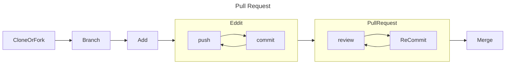
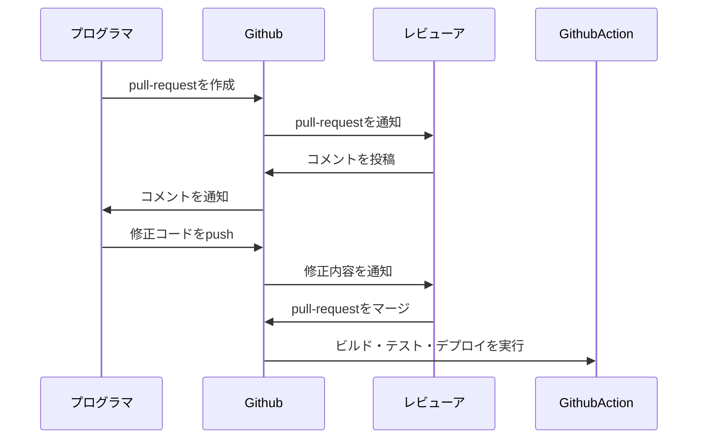

# Git / GitHub について

## Git とは?

> Git（ギット）は、プログラムのソースコードなどの変更履歴を記録・追跡するための分散型バージョン管理システムである
> 
> [*Wikipedia*](https://ja.m.wikipedia.org/wiki/Git) *より*

主にプログラミングなどのソースコードを管理するもの。

## GitHub とは?

Git を GUI で操作できるようにしたもの

## Git の使い方

|command|説明|
|-------|---|
|config|Git の設定関連をするコマンド。`git config` で一覧が見れたり、後に続けて設定項目も打つことで設定できる。一番最初にやらないと使えない。|
|init|フォルダを git フォルダとして初期化するためのコマンド|
|…|…|
|push|git 上のリモートリポジトリにアップする時のコマンド|

### Git のインストール方法

1. [git の公式サイト](https://gitforwindows.org/) にアクセスする
1. ダウンロードする
1. `config` あたりの設定をする

## GitHub の使い方

### アカウント作成の流れ

1. メアド登録
1. パスワード
1. 色々

### プルリクエストの流れ

**そもそもプルリクとは？**\
プルリク | プルリクエスト | PR とは、Git においてなんたらの意味を持つものである。こうたらしてからああたらすることでこんなことができる。

#### フローチャート

#### ユースケース

## その他

### コンフリクトが起きた場合

**コンフリクトとは？**\
コンフリクトとは…

### GitHub Copilot とは

### 便利な使い方

### OSS について
